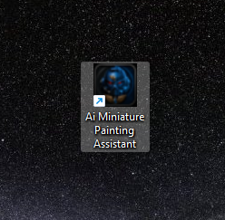
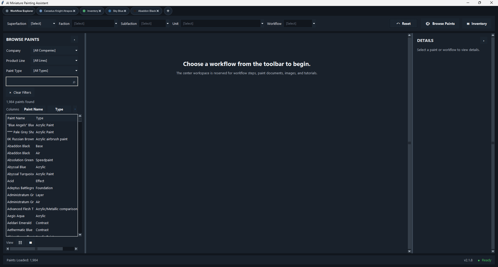
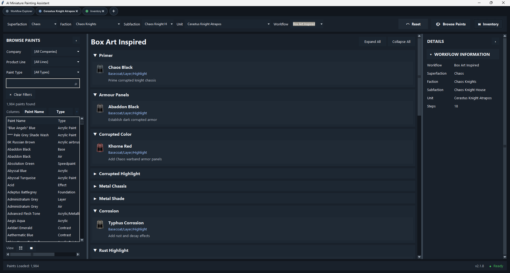
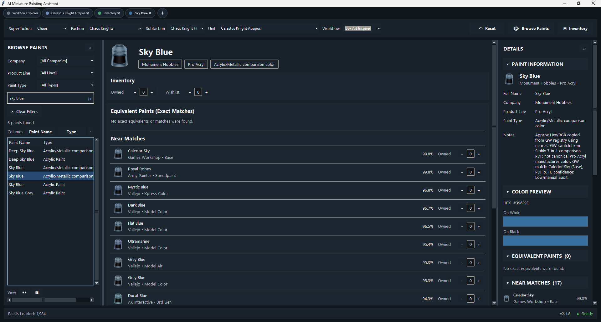
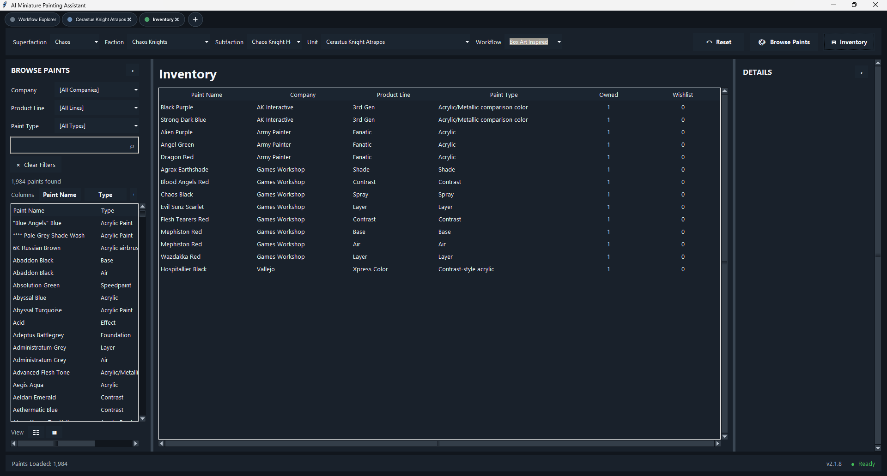

Skip to content
SCalkins-db
ai-miniature-painting-assistant
Repository navigation
Code
Issues
Pull requests
Agents
Actions
Projects
Security and quality
Insights
Settings
Files
Go to file
t
T
.gitignore
LICENSE
README.md
ai-miniature-painting-assistant
/
README.md
in
main

Edit

Preview
Indent mode

Spaces
Indent size

2
Line wrap mode

Soft wrap
Editing README.md file contents
  1
  2
  3
  4
  5
  6
  7
  8
  9
 10
 11
 12
 13
 14
 15
 16
 17
 18
 19
 20
 21
 22
 23
 24
 25
 26
 27
 28
 29
 30
 31
 32
 33
 34
 35
 36
 37
 38
 39
 40
 41
 42
 43
 44
 45
 46
 47
 48
 49
 50
 51
 52
 53
 54
 55
 56
# AI Miniature Painting Assistant

**A Python desktop application for miniature painters featuring workflow exploration, paint management, inventory tracking, cross-brand paint matching, and intelligent recommendation tools.**

---

## Overview

The AI Miniature Painting Assistant is a desktop application designed to simplify miniature painting by bringing paint management, workflow organization, and paint recommendations together in a single interface.

Originally developed during a Software Development internship, the project evolved into a full-stack desktop application focused on backend architecture, structured data management, recommendation systems, and future AI-assisted painting guidance.

---

# Screenshots

## Workflow Explorer

Browse professionally organized painting workflows by superfaction, faction, subfaction, unit, and workflow style.

---

## Paint Browser & Recommendation Engine

Search nearly 2,000 paints, compare manufacturers, preview colors, manage inventory, and discover similar paints using RGB-based matching.

---

## Inventory Manager

Track owned paints and wishlist items while integrating inventory directly into recommendation workflows.

---

# Features

### Workflow Explorer

- Organized by Superfaction
- Faction navigation
- Subfaction support
Use Control + Shift + m to toggle the tab key moving focus. Alternatively, use esc then tab to move to the next interactive element on the page.
No file chosen
Attach files by dragging & dropping, selecting or pasting them.
 